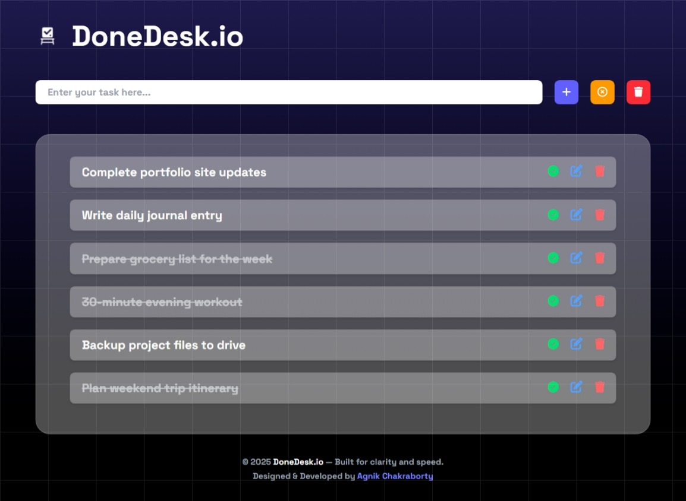

# ✅ DoneDesk.io

**DoneDesk.io** is a clean and minimalist task management app built using **vanilla HTML**, **Tailwind CSS**, and **JavaScript**.

It helps users stay organized by enabling them to quickly add, delete, and manage daily tasks — all within a distraction-free interface.

> ⚙️ **Dev Note:** A React-powered Version 2 of DoneDesk.io is planned with theme support and more features!

---

## 📸 Preview

  
<sub>*Lightweight and elegant task experience.*</sub>

---

## 🚀 Features

- 📖 Effortless task addition and deletion  
- 💾 Auto-saving using **localStorage**  
- ✔️ One-click task completion with strikethrough  
- 🖋️ Inline task editing with keyboard shortcuts  
- 📱 Fully responsive (mobile + desktop support)  
- ⚡ Lightweight and fast interface  

---

## 🛠️ Tech Stack

- **HTML5**  
- **Tailwind CSS (v4.1.11)**  
- **Vanilla JavaScript (ES6+)**  
- **LocalStorage API**

---

## 📦 Getting Started

To run this locally:

```bash
git clone https://github.com/your-username/DoneDesk.io.git
cd DoneDesk.io
# Open index.html in browser (you can use Live Server in VS Code)
```

Make sure Tailwind is compiled to `output.css`. If not:

```bash
npx tailwindcss -i ./src/input.css -o ./src/output.css --watch
```

---

## 📁 Folder Structure

```
DoneDesk.io/
├── src/
│   ├── index.html
│   ├── input.css
│   ├── output.css
│   ├── app.js
├── tailwind.config.js
├── README.md
├── package.json
└── assets/
    └── logo.svg
```

---

## 🎯 Roadmap

- [x] Add/Edit/Delete Task UI  
- [x] Inline editing with keyboard support  
- [x] LocalStorage sync  
- [x] Responsive layout  
- [x] Minimalist branding with logo  
- [ ] **[Planned]** Theme toggle support (v2)  
- [ ] **[Planned]** React-based refactor (v2)  

---

## 📄 License

This project is for learning and personal use. For professional use or contributions, feel free to fork or reach out via GitHub.

---

## ✨ Designed & Built by

**Agnik Chakraborty**  
[GitHub](https://github.com/Lucid-val)
